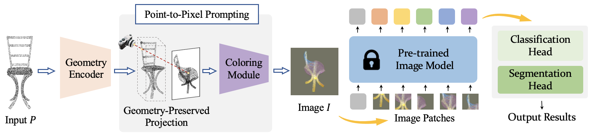
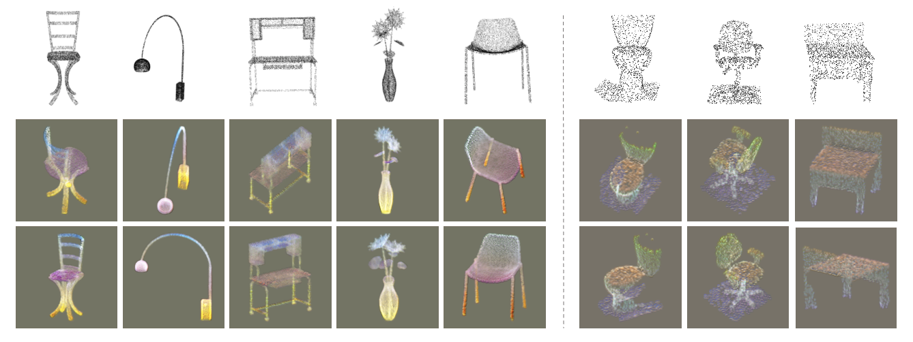

# P2P: Tuning Pre-trained Image Models for Point Cloud Analysis with Point-to-Pixel Prompting

[](https://paperswithcode.com/sota/3d-point-cloud-classification-on-scanobjectnn?p=p2p-tuning-pre-trained-image-models-for-point)

Created by [Ziyi Wang*](https://wangzy22.github.io/), [Xumin Yu*](https://yuxumin.github.io/), [Yongming Rao*](https://raoyongming.github.io/), [Jie Zhou](https://scholar.google.com/citations?user=6a79aPwAAAAJ&hl=en&authuser=1), [Jiwen Lu](https://scholar.google.com/citations?user=TN8uDQoAAAAJ&hl=zh-CN)


This repository is an official implementation of **P2P (NeurIPS 2022 Spotlight)**.

<div align=left>

</div>

P2P is a framework to leverage pre-trained ***image*** models for ***3D analysis***. We transform point clouds into colorful images with newly proposed geometry-preserved projection and geometry-aware coloring to adapt to pre-trained image models, whose weights are kept frozen during the end-to-end optimization of point cloud understanding tasks. 

[[arXiv](http://arxiv.org/abs/2208.02812)][[Project Page](http://p2p.ivg-research.xyz)][[Models](https://github.com/wangzy22/P2P#quantitative-results)]




## Preparation

### Installation Prerequisites

- Python 3.9
- CUDA 11.3
- PyTorch 1.11.1
- timm 0.5.4
- torch_scatter
- pointnet2_ops
- cv2, sklearn, yaml, h5py

```
conda create -n p2p python=3.9
conda activate p2p
conda install pytorch==1.11.0 torchvision==0.12.0 torchaudio==0.11.0 cudatoolkit=11.3

mkdir lib
cd lib
git clone https://github.com/erikwijmans/Pointnet2_PyTorch.git
cd Pointnet2_PyTorch
pip install pointnet2_ops_lib/.
cd ../..

pip install torch-scatter -f https://data.pyg.org/whl/torch-1.11.0+cu113.html
pip install timm==0.5.4
pip install opencv-python
pip install scikit-learn, h5py
conda install pyyaml, tqdm
```

### Data Preparation

- Download the processed ModelNet40 dataset from [[Google Drive]](https://drive.google.com/drive/folders/1fAx8Jquh5ES92g1zm2WG6_ozgkwgHhUq?usp=sharing)[[Tsinghua Cloud]](https://cloud.tsinghua.edu.cn/d/4808a242b60c4c1f9bed/)[[BaiDuYun]](https://pan.baidu.com/s/18XL4_HWMlAS_5DUH-T6CjA )(code:4u1e). Or you can download the offical ModelNet from [here](https://shapenet.cs.stanford.edu/media/modelnet40_normal_resampled.zip), and process it by yourself.

- Download the official ScanObjectNN dataset from [here](http://103.24.77.34/scanobjectnn).

- The data is expected to be in the following file structure:
    ```
    P2P/
    |-- config/
    |-- data/
        |-- ModelNet40/
            |-- modelnet40_shape_names.txt
            |-- modelnet_train.txt
            |-- modelnet_test.txt
            |-- modelnet40_train_8192pts_fps.dat
            |-- modelnet40_test_8192pts_fps.dat
        |-- ScanObjectNN/
            |-- main_split/
                |-- training_objectdataset_augmentedrot_scale75.h5
                |-- test_objectdataset_augmentedrot_scale75.h5
    |-- dataset/
    ```

## Usage

### Train

```
bash tool/train.sh EXP_NAME CONFIG_PATH DATASET
```

For example, to train P2P model with ConvNeXt-B-1k as base model on the ModelNet40 dataset:

```
bash tool/train.sh p2p_ConvNeXt-B-1k config/ModelNet40/p2p_ConvNeXt-B-1k.yaml ModelNet40
```

### Test

```
bash tool/test.sh EXP_NAME CONFIG_PATH DATASET
```

For example, to test P2P model with ConvNeXt-B-1k as base model the ModelNet40 dataset:

```
bash tool/test.sh p2p_ConvNeXt-B-1k config/ModelNet40/p2p_ConvNeXt-B-1k.yaml ModelNet40
```

### Reproduce

```
bash tool/reproduce.sh DATASET MODEL
```

For example, to reproduce results of P2P model with ConvNeXt-B-1k as base model on the ModelNet40 dataset with our provided checkpoint:

```
bash tool/reproduce.sh ModelNet40 ConvNeXt-B-1k
```

## Results

### Quantitative Results

We provide pretrained P2P models:
| Image Model      | ModelNet Acc.     | ScanObjectNN Acc. |
| :--------------: | :---------------: | :---------------: |
| HorNet-L-22k-mlp | 94.0 [[Google](https://drive.google.com/file/d/1AtQ3QcJpte1j-8-B1F7eqmxBv2Gn-zLl/view?usp=sharing) / [Tsinghua Cloud](https://cloud.tsinghua.edu.cn/f/8bd075ba5e154b9ca179/?dl=1)] | 89.3 [[Google](https://drive.google.com/file/d/1XwM3ry676fzkl-gOlg9NZGsGQV4UzLIO/view?usp=sharing) / [Tsinghua Cloud](https://cloud.tsinghua.edu.cn/f/ea8dbbdfdb5944bd916a/?dl=1)] |
| ResNet-18        | 91.6 [[Google](https://drive.google.com/file/d/1ZqRq-lhHZzuYOpgFKzMkxZLg7d1qrymV/view?usp=sharing) / [Tsinghua Cloud](https://cloud.tsinghua.edu.cn/f/857e25231319491ea3ba/?dl=1)] | 82.6 [[Google](https://drive.google.com/file/d/1blvRMHWaJBf7E2GAuFpJ5UmdZNFoihjk/view?usp=sharing) / [Tsinghua Cloud](https://cloud.tsinghua.edu.cn/f/46dbeb4ed1a6400b8728/?dl=1)] |
| ResNet-50        | 92.5 [[Google](https://drive.google.com/file/d/1-OovW8Jx37B4oqca7oYiecNDx_5jZPkb/view?usp=sharing) / [Tsinghua Cloud](https://cloud.tsinghua.edu.cn/f/bd1d0c84a04d44b2a5a4/?dl=1)] | 85.8 [[Google](https://drive.google.com/file/d/1LBFFTqByITl6CrM_oFR92IZWat4zPuch/view?usp=sharing) / [Tsinghua Cloud](https://cloud.tsinghua.edu.cn/f/8be167552e874e079b31/?dl=1)] |
| ResNet-101       | 93.1 [[Google](https://drive.google.com/file/d/17cHIrOydHaPFDMW8NrKnC-wTFXNWWQdp/view?usp=sharing) / [Tsinghua Cloud](https://cloud.tsinghua.edu.cn/f/7ec010b81f3b4a139036/?dl=1)] | 87.4 [[Google](https://drive.google.com/file/d/1HmsGKPAfr7-BMO8aCbHkM8y9VWLd-F3c/view?usp=sharing) / [Tsinghua Cloud](https://cloud.tsinghua.edu.cn/f/ae421c0023124f93ba19/?dl=1)] |
| ConvNeXt-T-1k    | 92.6 [[Google](https://drive.google.com/file/d/1Vn28tLE7fqvFue9DzZr28rcnvhmhxYF-/view?usp=sharing) / [Tsinghua Cloud](https://cloud.tsinghua.edu.cn/f/0735efb621b64ffbab5c/?dl=1)] | 84.9 [[Google](https://drive.google.com/file/d/1wfGh4Fg_LGu8Wsyk1uPY0lbbWpf7FsYL/view?usp=sharing) / [Tsinghua Cloud](https://cloud.tsinghua.edu.cn/f/b570855e970747509a5d/?dl=1)] |
| ConvNeXt-S-1k    | 92.8 [[Google](https://drive.google.com/file/d/1xCFpNXG9gwKgYFu7oHJVxUv6wtVMhFy1/view?usp=sharing) / [Tsinghua Cloud](https://cloud.tsinghua.edu.cn/f/8840eba6e0a141da91ca/?dl=1)] | 85.3 [[Google](https://drive.google.com/file/d/1Cw7X8n1yljTyO1-z5yGDsx16-6m7oW-q/view?usp=sharing) / [Tsinghua Cloud](https://cloud.tsinghua.edu.cn/f/f70c1e2c8fef41038a18/?dl=1)] |
| ConvNeXt-B-1k    | 93.0 [[Google](https://drive.google.com/file/d/18E0RnV4mS1vR36HNNpFjjMXxxvdd64GK/view?usp=sharing) / [Tsinghua Cloud](https://cloud.tsinghua.edu.cn/f/f555ba6b4504472c9742/?dl=1)] | 85.7 [[Google](https://drive.google.com/file/d/1kNtAkiTjWqE52a80RqrZBxAVtv7g-ygT/view?usp=sharing) / [Tsinghua Cloud](https://cloud.tsinghua.edu.cn/f/863957c0dc334947a251/?dl=1)] |
| ConvNeXt-L-1k    | 93.2 [[Google](https://drive.google.com/file/d/1VypdZ5okh3erw5PD3xjLfFWQqScEdpir/view?usp=sharing) / [Tsinghua Cloud](https://cloud.tsinghua.edu.cn/f/3295b9f19a754fe2a7e7/?dl=1)] | 86.2 [[Google](https://drive.google.com/file/d/1DosGp79jRnE6D2uDMjQuM1_cmOdntU-2/view?usp=sharing) / [Tsinghua Cloud](https://cloud.tsinghua.edu.cn/f/9165678ee1c6433d8d2f/?dl=1)] |
| ViT-T-1k         | 91.5 [[Google](https://drive.google.com/file/d/1h1ycIe72_p2ZT5t5aXN9iBB6Dd1wxcRx/view?usp=sharing) / [Tsinghua Cloud](https://cloud.tsinghua.edu.cn/f/811f2e7dd3ea42ad89ae/?dl=1)] | 79.7 [[Google](https://drive.google.com/file/d/1oHhJIB_136x9IJtSCso6y8CF17HvynAe/view?usp=sharing) / [Tsinghua Cloud](https://cloud.tsinghua.edu.cn/f/3cea2cac6ff44eb284fe/?dl=1)] |
| ViT-S-1k         | 91.8 [[Google](https://drive.google.com/file/d/1CJHdm1XgEF-ojfwEbKDigt717QRRxSXZ/view?usp=sharing) / [Tsinghua Cloud](https://cloud.tsinghua.edu.cn/f/f64fc932b1c94d888c45/?dl=1)] | 81.6 [[Google](https://drive.google.com/file/d/12rFYyW11aT9UR0VEPGwE_FVVTDYW_hTy/view?usp=sharing) / [Tsinghua Cloud](https://cloud.tsinghua.edu.cn/f/f34b74b3dc404c7e8c95/?dl=1)] |
| ViT-B-1k         | 92.7 [[Google](https://drive.google.com/file/d/1hdqdie8Oyvf4jeyFQ7gMyczq0Eso6tiM/view?usp=sharing) / [Tsinghua Cloud](https://cloud.tsinghua.edu.cn/f/edd22657a5fd4bed952f/?dl=1)] | 83.4 [[Google](https://drive.google.com/file/d/1wgR66K2USSZPkP_kXP-AQir9eIkcPJM0/view?usp=sharing) / [Tsinghua Cloud](https://cloud.tsinghua.edu.cn/f/ba477130a9e044b683ec/?dl=1)] |
| Swin-T-1k        | 92.1 [[Google](https://drive.google.com/file/d/1gQ0HtMufPHP-NLQjxBJa-jKEQPa2pngL/view?usp=sharing) / [Tsinghua Cloud](https://cloud.tsinghua.edu.cn/f/285785cecdba447391c5/?dl=1)] | 82.9 [[Google](https://drive.google.com/file/d/12fOGZAmpnCUKwpZzFi-gAy0o6WEfMAEM/view?usp=sharing) / [Tsinghua Cloud](https://cloud.tsinghua.edu.cn/f/08c4a5bbacc845c8aaa0/?dl=1)] |
| Swin-S-1k        | 92.5 [[Google](https://drive.google.com/file/d/16KFHBXaGM6Yx3jJgQJW-j00L_vfpmA4W/view?usp=sharing) / [Tsinghua Cloud](https://cloud.tsinghua.edu.cn/f/22cc8e9c636848a4a1ff/?dl=1)] | 83.8 [[Google](https://drive.google.com/file/d/1iCtmq9RFESX8MHvQAx1IDk5z9ewGN-7l/view?usp=sharing) / [Tsinghua Cloud](https://cloud.tsinghua.edu.cn/f/ac8757e20b21493a920d/?dl=1)] |
| Swin-B-1k        | 92.6 [[Google](https://drive.google.com/file/d/1GQ_H9M9rPi49DzRVou8tYo-ED1WUNRp9/view?usp=sharing) / [Tsinghua Cloud](https://cloud.tsinghua.edu.cn/f/7b91607c932046fba8da/?dl=1)] | 84.6 [[Google](https://drive.google.com/file/d/1J4m8SP241To2wDo7h2oAfSYHDEb7iP1M/view?usp=sharing) / [Tsinghua Cloud](https://cloud.tsinghua.edu.cn/f/ddfe72bc57a34c3db73b/?dl=1)] |


To train our P2P framework with HorNet-L-22k as the image model, please download the [pre-trained weight](https://cloud.tsinghua.edu.cn/f/8679b6acf63c41e285d9/?dl=1) from the official [HorNet](https://github.com/raoyongming/HorNet) repo. Please organize the directory as the following structure:
```
    P2P/
    |-- pretrained/
        |-- hornet_large_gf_in22k.pth
        |-- reproduce/
            |-- ckpt/
                |-- ModelNet40/
                    |-- ConvNeXt-B-1k-ModelNet40.pth
                |-- ScanObjectNN/
                    |-- ConvNeXt-B-1k-ScanObjectNN.pth
```

### Visualization Results



## Citation

If you find our work useful in your research, please consider citing:

```
@article{wang2022p2p,
title={P2P: Tuning Pre-trained Image Models for Point Cloud Analysis with Point-to-Pixel Prompting},
author={Wang, Ziyi and Yu, Xumin and Rao, Yongming and Zhou, Jie and Lu, Jiwen},
journal={arXiv preprint arXiv:2208.02812},
year={2022}
}
```

## Acknowledgements

Our code is inspired by [BPNet](https://github.com/wbhu/BPNet), [Point-BERT](https://github.com/lulutang0608/Point-BERT).
